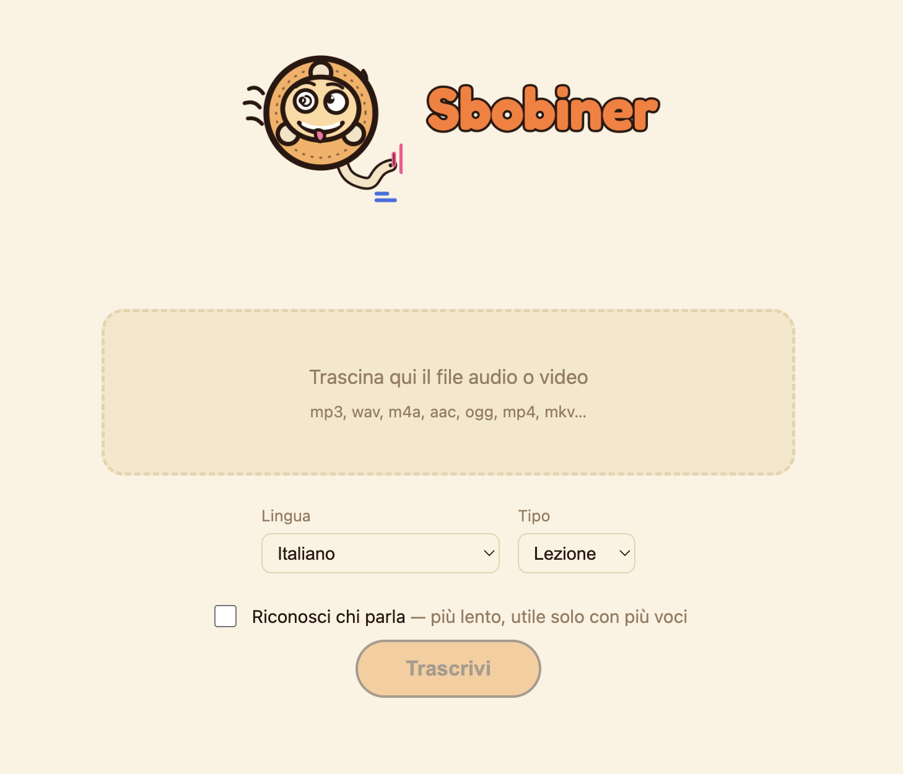

# Sbobiner

*🇬🇧 [English version below](diventa Sbobyner).*

> Sempre più difficile trascrivere un audio. Tutti i servizi sono a pagamento o funzionano male.
> Questo non sarà perfetto, ma fa il suo. E il file resta sul tuo pc.
> Fatto per MAC perché è quello che uso al momento. Liberi di contribuire.
>
> Installi una sola volta. Carichi il file. Trascrivi (nel frattempo fai altro). Salvi la trascrizione. Fine.
> N.B.: Non puoi trascrivere un concerto.

<p align="center">
  
</p>

<p align="center">
  <a href="https://ko-fi.com/E7D425WCX9"></a>
</p>
<p align="center">
"If it works, I'm a genius. If it doesn't, it's the AI's fault."
</p>

PER ORA SOLO MAC APPLE SILICON

Pipeline di trascrizione per **lezioni e riunioni**, costruita su Whisper.
Gira interamente **offline** dopo il setup iniziale. Nessun account, nessun token.

Motore: [`mlx-whisper`](https://github.com/ml-explore/mlx-examples/tree/main/whisper)
Diarization: [`sherpa-onnx`](https://github.com/k2-fsa/sherpa-onnx) (modelli liberi, senza gating).

---

## Setup iniziale (solo la prima volta, serve internet)

Doppio click su **`setup.command`**.

Questo crea l'ambiente virtuale, installa le dipendenze e scarica i modelli
(~460 MB per Whisper + ~35 MB per la diarization). `ffmpeg` è incluso, non va installato.
Ingombro totale dell'installazione: **~1,1 GB** (`.venv` + modelli).

## Uso quotidiano (Offline)

Doppio click su **`start.command`** dal Finder.
Si apre il browser su `http://127.0.0.1:5000`: trascina il file, scegli le opzioni, premi **Trascrivi**.
A fine elaborazione scarichi in **TXT**, **SRT**, **VTT** o **DOCX**.

Formati in ingresso: qualsiasi cosa `ffmpeg` sappia leggere (mp3, wav, m4a, aac, ogg, flac,
e anche video mp4/mkv/mov — l'audio viene estratto in automatico).

N.B. la finestra del terminale deve rimanere aperta per permettere a Sbobiner di funzionare nella pagina web.

---

## Configurazione — `config.yaml`

Tutto si può regolare da lì, senza toccare il codice.

### Cambiare lingua

```yaml
language: it        # italiano (default)
```

- Cambio lingua tramite codice ISO 639-1 (`en`, `fr`, `de`, `es`, `pt`, ...).
- `auto`: Whisper rileva la lingua da solo (più lento, meno preciso).

### Modello Whisper

```yaml
model:
  name: large-v3-turbo-q4
```

| Valore | Peso | Note |
|---|---|---|
| `large-v3-turbo-q4` | ~460 MB | **default**. turbo quantizzato a 4 bit: leggero, qualità vicina al turbo pieno. |
| `large-v3-turbo` | ~1.5 GB | un filo più preciso, occupa 3× lo spazio. |
| `medium` | ~1.5 GB | fallback. |
| `small` | ~500 MB | ~2× più veloce, meno preciso. |
| `large-v3` | ~3 GB | massima precisione, consigliato con 16 GB+ di RAM. |

Dopo aver cambiato `name`, riesegui `python download_models.py` (con la `.venv` attiva) per scaricarlo:
stampa anche il comando per cancellare il modello vecchio dalla cache e recuperare spazio.

Perché il turbo (e non `large-v3`): è `large-v3` distillato (8 layer di decoder invece di 32),
precisione in trascrizione quasi identica ma molto più veloce. La variante `-q4` dimezza
ancora il peso su disco con una perdita di qualità minima; la velocità resta simile.

### Glossario e correzioni

```yaml
glossary:            # iniettati come bias: aiutano su nomi propri e termini tecnici
  - Kubernetes
  - "Rossi"          # cognomi ricorrenti del corso/team
corrections:         # sostituzione esatta a valle, se un termine esce comunque sbagliato
  "cuber netes": Kubernetes
```

### Diarization (chi parla) per contesto

```yaml
diarization:
  preset: riunione   # oppure: aula
  aula:      { num_speakers: null, cluster_threshold: 0.70 }
  riunione:  { num_speakers: null, cluster_threshold: 0.50 }
```

- `aula`: molte persone, soglia più alta (raggruppa di più, evita di inventare voci).
- `riunione`: poche persone, soglia più bassa (separa meglio 2–6 parlanti).
- Se sai quante persone parlano, imposta `num_speakers` (es. `3`) o usa il campo
  **N. persone** nella pagina web: la diarization diventa più stabile.

### Post-elaborazione lezioni/riunioni

In `config.yaml` → `postprocess`: lista di intercalari da togliere, soglia di pausa per
i cambi di sezione, frasi-chiave per sezioni / action item / decisioni. Tutte modificabili.

> Sezioni e action item sono **euristici** (pause + frasi-trigger), non ML.
> Se un domani la precisione non basta, il punto di aggancio per un passaggio LLM locale
> è in `postprocess.py` (`_split_sections` / `_extract`), segnato con un commento `ponytail:`.

---

## Struttura

| File | Responsabilità |
|---|---|
| `audio.py` | normalizzazione di qualsiasi input → wav 16 kHz mono |
| `transcribe.py` | motore Whisper + iniezione glossario |
| `diarize.py` | riconoscimento di chi parla (sherpa-onnx), preset per contesto |
| `merge.py` | allineamento testo ↔ speaker |
| `postprocess.py` | pulizia, sezioni, action item, decisioni |
| `export.py` | TXT / SRT / VTT / DOCX |
| `app.py` + `templates/index.html` | server locale e pagina web |
| `config.yaml` | tutta la configurazione |
| `download_models.py` | scarica i modelli una volta |
| `test_pipeline.py` | self-check: `python test_pipeline.py` |

## Note

- Velocità misurata su Mac 8 GB con `large-v3-turbo-q4`
  (38 min di audio → ~3,5 min di trascrizione). Senza diarization.
- Tutto resta in locale, nella cartella `work/`. Contiene anche il
  `.wav` intermedio (~2 MB/min): svuotala quando vuoi.

## Crediti

Sviluppato con [Claude](https://claude.ai) (Claude Code) usando il plugin
**[ponytail](https://github.com/DietrichGebert/ponytail)** in modalità `ultra`, che spinge
verso la soluzione più semplice che funziona: libreria standard e funzionalità native
prima di aggiungere dipendenze o codice custom.

Componenti di terze parti: [`mlx-whisper`](https://github.com/ml-explore/mlx-examples)
(MIT) · [`sherpa-onnx`](https://github.com/k2-fsa/sherpa-onnx) (Apache-2.0) ·
[Whisper](https://github.com/openai/whisper) (MIT) · [Flask](https://flask.palletsprojects.com)
(BSD-3) · [python-docx](https://github.com/python-openxml/python-docx) (MIT).
I pesi dei modelli scaricati da `download_models.py` hanno licenze proprie dei rispettivi autori.

## Sostieni il progetto

Se ti è utile: [offrimi un caffè su Ko-fi](https://ko-fi.com/E7D425WCX9). Grazie.

## Changelog

Vedi [CHANGELOG.md](CHANGELOG.md).

## Licenza

[MIT](LICENSE).

---
---

<a id="english"></a>

# Sbobyner — in English

*🇮🇹 [Versione italiana sopra].*

> Transcribing audio keeps getting harder. Every service is paid or works badly.
> This won't be perfect, but it does the job. And the file stays on your computer.
> Built for Mac because that's what I use right now. Contributions welcome.
>
> Install once. Drop in the file. Transcribe (do something else meanwhile). Save the transcript. Done.
> N.B.: you can't transcribe a concert.

**MAC WITH APPLE SILICON ONLY, FOR NOW**

Transcription pipeline for **lectures and meetings**, built on Whisper.
Runs entirely **offline** after the initial setup. No account, no token.

Engine: [`mlx-whisper`](https://github.com/ml-explore/mlx-examples/tree/main/whisper)
Diarization: [`sherpa-onnx`](https://github.com/k2-fsa/sherpa-onnx).

---

## Initial setup (first time only, needs internet)

Double-click **`setup.command`**.

This creates the virtual environment, installs the dependencies and downloads the models
(~460 MB for Whisper + ~35 MB for diarization). `ffmpeg` is bundled, nothing to install.
Total install footprint: **~1.1 GB** (`.venv` + models).

## Daily use (offline)

Double-click **`start.command`** from Finder.
The browser opens at `http://127.0.0.1:5000`: drop the file, pick the options, press **Trascrivi** ("Transcribe").
When it's done you download as **TXT**, **SRT**, **VTT** or **DOCX**.

Input formats: anything `ffmpeg` can read (mp3, wav, m4a, aac, ogg, flac,
and video mp4/mkv/mov too — the audio is extracted automatically).

N.B. the terminal window must stay open for Sbobyner to keep serving the web page.

---

## Configuration — `config.yaml`

Everything can be tuned there, without touching the code.

### Change language

```yaml
language: it        # italian (default)
```

- Change language via ISO 639-1 code (`en`, `fr`, `de`, `es`, `pt`, ...).
- `auto`: Whisper detects the language on its own (slower, less accurate).

### Whisper model

```yaml
model:
  name: large-v3-turbo-q4
```

| Value | Size | Notes |
|---|---|---|
| `large-v3-turbo-q4` | ~460 MB | **default**. 4-bit quantized turbo: light, quality close to the full turbo. |
| `large-v3-turbo` | ~1.5 GB | slightly more accurate, 3× the disk space. |
| `medium` | ~1.5 GB | fallback. |
| `small` | ~500 MB | ~2× faster, less accurate. |
| `large-v3` | ~3 GB | maximum accuracy, recommended with 16 GB+ of RAM. |

After changing `name`, run `python download_models.py` again (with the `.venv` active) to fetch it:
it also prints the command to delete the old model from the cache and reclaim space.

Why turbo (and not `large-v3`): it's `large-v3` distilled (8 decoder layers instead of 32),
transcription accuracy almost identical but faster. The `-q4` variant halves the disk
size again with minimal quality loss; speed stays about the same.

### Glossary and corrections

```yaml
glossary:            # injected as bias: helps with proper nouns and technical terms
  - Kubernetes
  - "Rossi"          # surnames that recur in the course/team
corrections:         # exact downstream replacement, if a term still comes out wrong
  "cuber netes": Kubernetes
```

### Diarization (who's speaking) by context

```yaml
diarization:
  preset: riunione   # or: aula
  aula:      { num_speakers: null, cluster_threshold: 0.70 }
  riunione:  { num_speakers: null, cluster_threshold: 0.50 }
```

- `aula` (classroom): many people, higher threshold (groups more, avoids inventing voices).
- `riunione` (meeting): few people, lower threshold (separates 2–6 speakers better).
- If you know how many people speak, set `num_speakers` (e.g. `3`) or use the
  **N. persone** field on the web page: diarization becomes more stable.

### Lecture/meeting post-processing

In `config.yaml` → `postprocess`: list of filler words to strip, pause threshold for
section breaks, trigger phrases for sections / action items / decisions. All editable.

> Sections and action items are **heuristic** (pauses + trigger phrases), not ML.
> If one day the accuracy isn't enough, the hook for a local LLM pass is in
> `postprocess.py` (`_split_sections` / `_extract`), marked with a `ponytail:` comment.

---

## Layout

| File | Responsibility |
|---|---|
| `audio.py` | normalize any input → 16 kHz mono wav |
| `transcribe.py` | Whisper engine + glossary injection |
| `diarize.py` | speaker diarization (sherpa-onnx), presets by context |
| `merge.py` | align text ↔ speaker |
| `postprocess.py` | cleanup, sections, action items, decisions |
| `export.py` | TXT / SRT / VTT / DOCX |
| `app.py` + `templates/index.html` | local server and web page |
| `config.yaml` | all configuration |
| `download_models.py` | download the models once |
| `test_pipeline.py` | self-check: `python test_pipeline.py` |

## Notes

- Speed measured on an 8 GB Mac with `large-v3-turbo-q4`
  (38 min of audio → ~3.5 min of transcription). Without diarization.
- Everything stays local, in the `work/` folder. It also holds the intermediate
  `.wav` (~2 MB/min): empty it whenever you want.

## Credits

Built with [Claude](https://claude.ai) (Claude Code) using the
**[ponytail](https://github.com/DietrichGebert/ponytail)** plugin in `ultra` mode, which pushes
toward the simplest thing that works: standard library and native features
before adding dependencies or custom code.

Third-party components: [`mlx-whisper`](https://github.com/ml-explore/mlx-examples)
(MIT) · [`sherpa-onnx`](https://github.com/k2-fsa/sherpa-onnx) (Apache-2.0) ·
[Whisper](https://github.com/openai/whisper) (MIT) · [Flask](https://flask.palletsprojects.com)
(BSD-3) · [python-docx](https://github.com/python-openxml/python-docx) (MIT).
The model weights downloaded by `download_models.py` have their own licenses from their respective authors.

## Support the project

If you find it useful: [buy me a coffee on Ko-fi](https://ko-fi.com/E7D425WCX9). Thanks.

## Changelog

See [CHANGELOG.md](CHANGELOG.md).

## License

[MIT](LICENSE).
